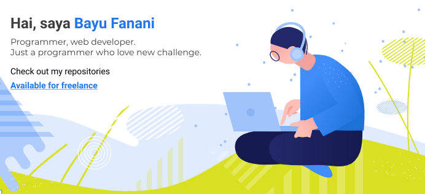

## Assalamu'alaikum wr. wb

Proficient in fullstack PHP, a little good at Node js, and currently learning docker, scalable app and other fun stuffs i can do in my free times.  

I don't like to remembering things i think it's better if i can **understand** why i wrote that code. **I also looking  collaboration** in any fun stuff especially frontend. 😁

Anyway i am available for freelance work, building frontend, fullstack PHP anything that related to web development. I am not a senior programmer so there are still many things that i need to learn so i hope by building this resume i can step by step became senior programmer. 😁 
You can reach me at [Bayu Fanani](mailto:fanani707@gmail.com?subject=hai)

<!--
**bayufanani/bayufanani** is a ✨ _special_ ✨ repository because its `README.md` (this file) appears on your GitHub profile.

Here are some ideas to get you started:

- 🔭 I’m currently working on ...
- 🌱 I’m currently learning ...
- 👯 I’m looking to collaborate on ...
- 🤔 I’m looking for help with ...
- 💬 Ask me about ...
- 📫 How to reach me: ...
- 😄 Pronouns: ...
- ⚡ Fun fact: ...
-->
